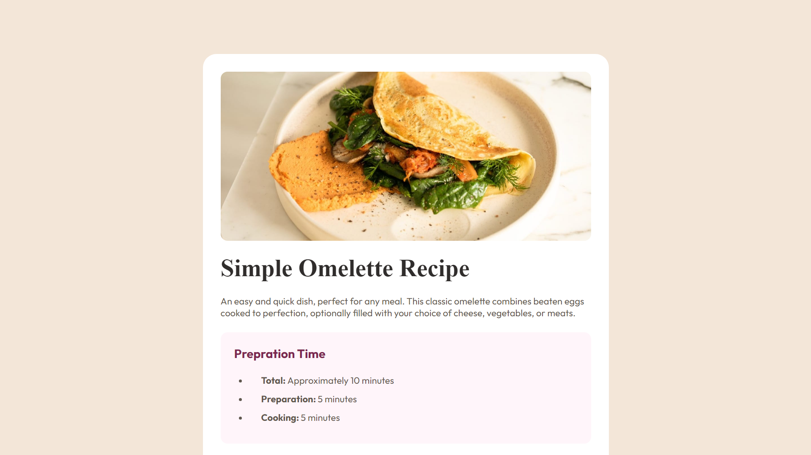
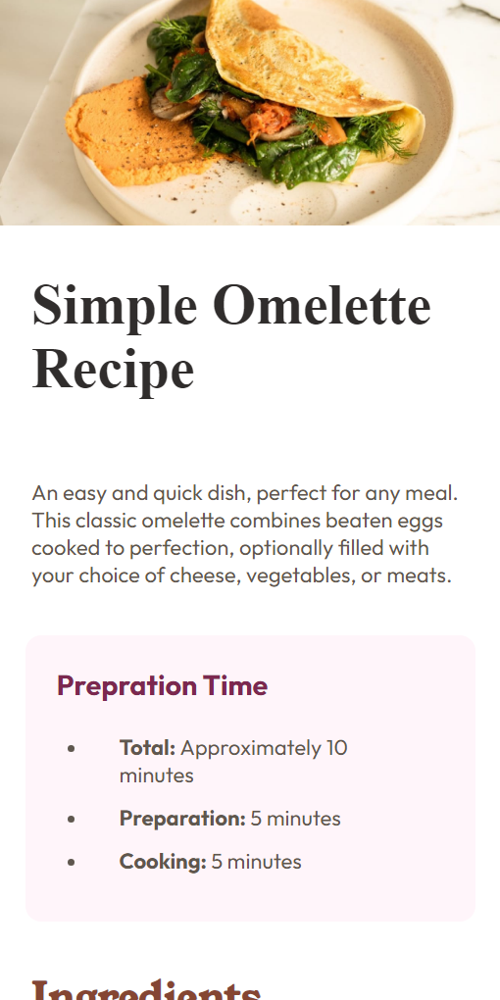

# recipe-page-FEM

# Frontend Mentor - Recipe page solution

This is a solution to the [Recipe page challenge on Frontend Mentor](https://www.frontendmentor.io/challenges/recipe-page-KiTsR8QQKm). Frontend Mentor challenges help you improve your coding skills by building realistic projects. 

## Table of contents

- [Overview](#overview)
  - [The challenge](#the-challenge)
  - [Screenshot](#screenshot)
  - [Links](#links)
- [My process](#my-process)
  - [Built with](#built-with)
  - [What I learned](#what-i-learned)
  - [Continued development](#continued-development)
  - [Useful resources](#useful-resources)
- [Author](#author)
- [Acknowledgments](#acknowledgments)

## Overview

### Screenshots

### Screenshot Desktop

### Screenshot Mobile

### Links

- Solution URL: [Add solution URL here](https://github.com/hianshul07/recipe-page-FEM)
- Live Site URL: [Add live site URL here](https://hianshul07.github.io/recipe-page-FEM)

### Built with

- Semantic HTML5 markup
- CSS custom properties
- Flexbox
- CSS Grid

## Author

- Website - [Gitgub](https://github.com/hianshul07)
- Frontend Mentor - [@yourusername](https://www.frontendmentor.io/profile/hianshul07)
- Twitter - [@hianshul07](https://www.twitter.com/hianshul07)